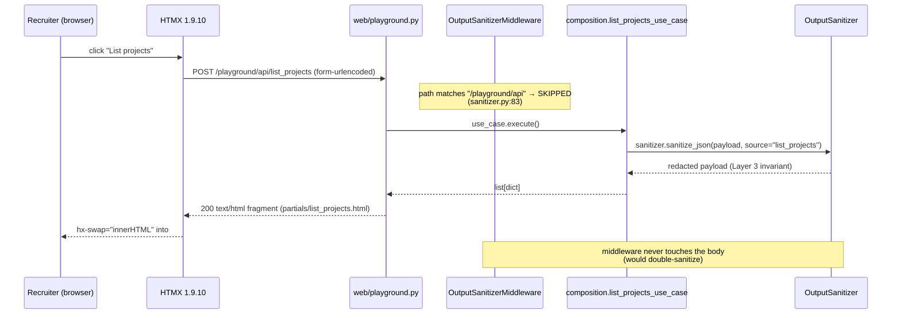
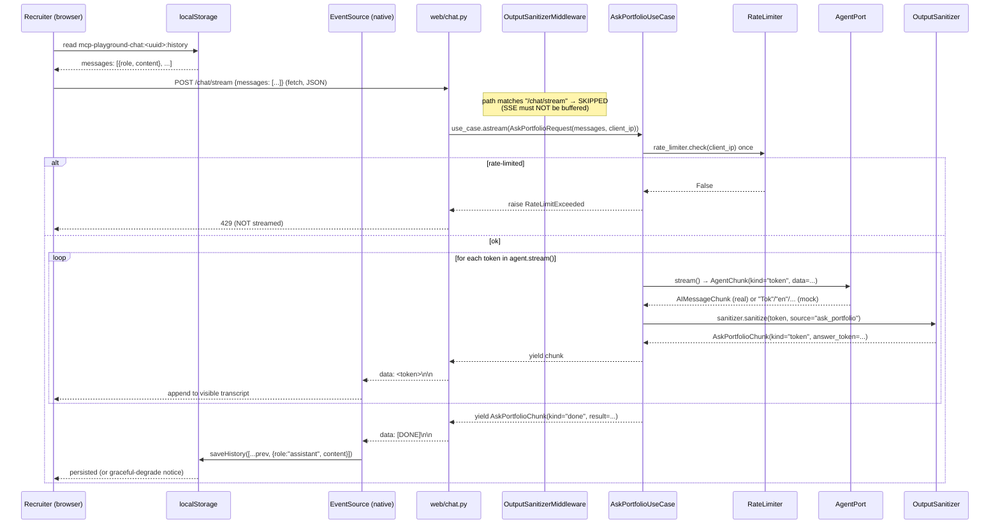
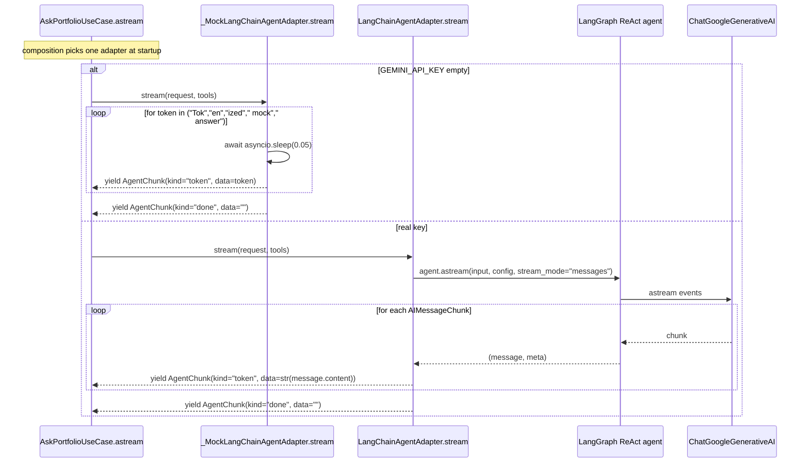

# Design: 003-playground-ui — Browser Playground + Streaming Chat

## Technical Approach

Additive surface over the existing hexagonal stack: a new `interfaces/http/web/` adapter package owns the browser-facing routes, reuses every use case from `composition.py` (no business logic moves, no new ports, no new adapters), and persists nothing on the server. The MCP transport at `/mcp` stays the canonical interface; the playground is a parallel HTTP surface for recruiters without Claude Desktop / Cursor. Two vertical PRs — PR1 (forms + skip-list + Docker COPY) and PR2 (streaming chat + agent port extension + localStorage persistence) — keep each review under the 400-line budget per `openspec/config.yaml` `rules.tasks.review_budget_lines`. Per Decision #5 sanitization moves from the HTTP middleware into `AskPortfolioUseCase.astream` for SSE bytes (middleware buffers; use case streams per-token). Per Decision #11 the chat server is stateless — `localStorage` in the browser owns the conversation.

## Architecture Overview

Hexagonal layers unchanged from `002-mcp-tools`; new surface is `interfaces/http/web/` (forms + chat) plus a per-token sanitize path inside `AskPortfolioUseCase.astream`. The composition root wires zero new adapters — the web router reads use cases from `app.state.composition` exactly like the MCP tool wrappers do.

```
Browser  ──GET /──┐                       ┌── POST /mcp ──► FastMCP tool wrappers
                  │                       │                    │
   ──GET /playground──► web/playground.py ──┤                    ▼
                  │       │               │           application/use_cases/* (existing)
   ──POST /playground/api/{tool}──►       │                    │
                  │       │               │                    ▼
   ──GET /chat──► web/chat.py ────────────┤            domain/* (pure, unchanged)
                  │       │               │
   ──POST /chat/stream──► chat.py ────────┤
                          │   EventSourceResponse
                          │   ask_portfolio_use_case.astream()
                          │   ├─ rate_limiter.check()        ← Layer 5 (existing)
                          │   ├─ agent.stream()              ← NEW: AgentPort.stream
                          │   │   ├─ LangChainAgentAdapter.astream(stream_mode="messages")
                          │   │   └─ _MockLangChainAgentAdapter (5 fake tokens)
                          │   └─ sanitizer.sanitize(token)   ← Layer 3 per-token (NEW)
                          ▼
                     SSE: data: <token>\n\n … data: [DONE]\n\n
```

The OutputSanitizerMiddleware (`interfaces/http/middleware/sanitizer.py`) is unchanged in behavior; only its skip-list gains 4 prefixes. The per-token sanitize inside the use case preserves the Layer 3 invariant — the middleware cannot catch SSE bytes because it buffers full bodies (`sanitizer.py:86-91`).

## Component Map

```
src/mcp_server/
├── application/
│   ├── ports/agent.py                    [MOD: + AgentChunk, + stream()]
│   └── use_cases/ask_portfolio.py        [MOD: + AskPortfolioChunk, + astream()]
├── infrastructure/langchain.py           [MOD: + stream() on 2 adapters]
├── interfaces/
│   ├── http/
│   │   ├── healthz.py                    [unchanged]
│   │   ├── middleware/sanitizer.py       [MOD: SKIP_PATH_PREFIXES 2 → 6]
│   │   └── web/                          [NEW package]
│   │       ├── __init__.py               [NEW: re-export build_web_router]
│   │       ├── deps.py                   [NEW: get_composition(request) helper]
│   │       ├── playground.py             [NEW: 5 POST /playground/api/{tool} routes]
│   │       └── chat.py                   [NEW: GET /chat + POST /chat/stream]
│   └── mcp/tools.py                      [unchanged — MCP still uses aexecute]
├── app.py                                [MOD: +1 line: app.include_router(build_web_router())]
└── composition.py                        [unchanged — web router reads app.state.composition]
playground/                               [NEW directory]
├── templates/
│   ├── base.html                         [NEW: layout, /static/htmx + /static/style]
│   ├── index.html                        [NEW: / landing]
│   ├── playground.html                   [NEW: 5 form cards (HTMX hx-post)]
│   ├── chat.html                         [NEW: native EventSource client + ~40 LOC JS]
│   └── partials/
│       ├── list_projects.html            [NEW: project list fragment]
│       ├── search_code.html              [NEW: matches fragment]
│       ├── explain_architecture.html     [NEW: summary + sources]
│       ├── summarize_readme.html         [NEW: one-paragraph summary]
│       └── architecture_diagram.html     [NEW: inline SVG + view-full link]
└── static/
    ├── htmx.min.js                       [NEW: vendored 47,755 bytes / ~48 KB, MIT, no CDN; ~14 KB gzipped — REL-6 amendment]
    └── style.css                         [NEW: Solarized Phosphor :root tokens]
pyproject.toml                            [MOD: langgraph pin → ">=0.2,<2.0"]
Dockerfile                                [MOD: +1 COPY line for playground/]
```

## Sequence — `POST /playground/api/list_projects` form submission



The fragment is rendered server-side via a single shared `Jinja2Templates` instance bound to `playground/templates/`. No JSON marshalling on the client — HTMX swaps the HTML directly.

## Sequence — `POST /chat/stream` SSE flow (the critical path)



Three things must hold simultaneously:
1. **Per-token sanitization is the only Layer 3 pass.** Middleware skip is required; the use case owns it.
2. **Rate-limit gate fires exactly once per request** (same contract as `aexecute`).
3. **The mock adapter and the real adapter yield the same chunk shape** (`AgentChunk(kind="token", data=str)`) — the SSE encoder and the client never branch on the source.

## Sequence — Mock vs real adapter parity

Both paths through `AgentPort.stream` produce the same `AgentChunk` shape:



Recruiters with no `GEMINI_API_KEY` (default in dev) hit the mock path; recruiters hitting the deployed Fly.io instance (where `GEMINI_API_KEY` is set as a Fly secret) hit the real path. Same UI, same SSE contract.

## Sanitizer middleware interaction

The middleware's contract is unchanged: rewrite every non-skipped response body through `OutputSanitizer`. What changes is the set of paths the middleware MUST NOT touch.

| Route prefix | Before 003 | After 003 | Reason |
|---|---|---|---|
| `/healthz` | skipped | skipped | unchanged (probe payload) |
| `/mcp` | skipped | skipped | unchanged (MCP governed by tool-layer sanitizer) |
| `/chat` | sanitized | **skipped** | chat HTML references `/chat/stream`; double-rewrite breaks the script |
| `/chat/stream` | sanitized (would break SSE) | **skipped** | **CRITICAL** — middleware buffers full bodies; SSE needs to flow as tokens stream |
| `/playground` | sanitized | **skipped** | HTML page; CSAT/template body must reach the browser verbatim |
| `/playground/api` | sanitized | **skipped** | fragments already passed through `sanitizer.sanitize(...)` inside the use case (Layer 3 invariant); double-pass is wasted work and risk |
| `/static/*` | sanitized | **skipped** (added for symmetry) | vendored HTMX is a JS file; redaction would corrupt the file |
| any other route | sanitized | sanitized | defense-in-depth fallback |

The 7-tuple literal at `sanitizer.py:39` becomes `("/healthz", "/mcp", "/chat", "/chat/stream", "/playground", "/playground/api", "/static")`. Test `tests/integration/test_sanitizer_middleware.py` is extended with one parametrized case per new prefix asserting `_should_skip(...)` returns `True` and the middleware leaves the body untouched.

## localStorage contract

The browser owns the conversation. The server holds nothing.

```javascript
// playground/templates/chat.html (inline <script>, ~40 LOC)
const NS = "mcp-playground-chat";

// 1. Session UUID — generated once on first visit, reused forever
let sid = localStorage.getItem(NS + ":sid");
if (!sid) {
  sid = (crypto.randomUUID && crypto.randomUUID()) ||
        ([1e7]+-1e3+-4e3+-8e3+-1e11).replace(/[018]/g, c =>
          (c ^ crypto.getRandomValues(new Uint8Array(1))[0] & 15 >> c/4).toString(16));
  try { localStorage.setItem(NS + ":sid", sid); } catch (_) { /* private mode */ }
}

// 2. History — keyed by session UUID, JSON array of {role, content}
const hkey = `${NS}:${sid}:history`;
function load() { try { return JSON.parse(localStorage.getItem(hkey) || "[]"); } catch { return []; } }
function save(m) { try { localStorage.setItem(hkey, JSON.stringify(m)); } catch (e) { notice("Conversations in this browser are not saved between reloads."); } }

// 3. Render prior turns BEFORE accepting new input (per chat-persistence spec)
renderHistory(load());

// 4. On submit — POST full history to /chat/stream
async function send(userText) {
  const messages = [...load(), { role: "user", content: userText }];
  const res = await fetch("/chat/stream", {
    method: "POST",
    headers: { "Content-Type": "application/json", "Accept": "text/event-stream" },
    body: JSON.stringify({ messages })
  });
  const reader = res.body.getReader(); const dec = new TextDecoder();
  let acc = "", dropped = false;
  while (true) {
    const { value, done } = await reader.read();
    if (done) break;
    for (const line of dec.decode(value).split("\n\n")) {
      if (!line.startsWith("data:")) continue;
      const payload = line.slice(5);
      if (payload === "[DONE]") { save([...messages, { role: "assistant", content: acc }]); return; }
      if (payload === "[ERROR]") { showInline("connection lost, retry?"); dropped = true; return; }
      acc += payload; renderAssistantDelta(payload);
    }
  }
  if (!dropped) showInline("connection lost, retry?");  // EOF without [DONE] → no append
}
```

- **Schema version**: v1 (implicit; current shape is the only one). Future schema migrations use a `:v2` suffix on the key (`mcp-playground-chat:<uuid>:history:v2`) and a one-time copy step on first read.
- **Graceful degradation**: every `try { localStorage.* }` is wrapped; on `QuotaExceededError` / `SecurityError` the notice flag renders and the UI continues in single-message mode (no history persistence, no crash).
- **No tracking, no cookies, no IP-based key**: the `sid` is the only client-side identifier; the server never sees it. `Set-Cookie` is absent from all `/chat*` responses.
- **SSE drop handling**: EOF without `data: [DONE]` renders an inline retry affordance and DOES NOT modify `localStorage` — no partial assistant message ever persists.

## Data flow — per-token sanitization (Layer 3 invariant under SSE)

```mermaid
flowchart LR
    A[AgentPort.stream] -->|AgentChunk kind=token| B[AskPortfolioUseCase.astream]
    B -->|answer_token| C[OutputSanitizer.sanitize]
    C -->|"[REDACTED]" if match| D[AskPortfolioChunk kind=token]
    C -->|verbatim| D
    D -->|data: <token>\\n\\n| E[EventSourceResponse]
    E -->|HTTP chunked transfer| F[Browser EventSource]
    F -->|onmessage| G[render delta + accumulate]
```



The Layer 3 invariant — "every byte that leaves the server passes through `OutputSanitizer`" — holds per chunk. The middleware was the wrong boundary for SSE (it buffers); the use case is the only correct boundary for streamed output. ADR-005 captures this in full.

## Error handling

| Failure mode | Detection | Response | User-visible affordance |
|---|---|---|---|
| Rate limit exceeded (Layer 5) | `rate_limiter.check()` returns `False` before streaming | 429 before any `data:` event | HTMX/EventSource sees HTTP 429 → toast "rate limit, retry in N s" |
| Project not found in manifest | use case raises `ManifestProjectNotFoundError` | 4xx with HTML fragment (playground) or JSON-RPC (MCP) | fragment: "project `foo` is not declared in the manifest" |
| LangGraph event shape changes (version regression) | `isinstance(message, AIMessageChunk)` fails | `astream` skips the chunk (defensive `try/except`) — does NOT raise | recruiter sees reduced tokens; unit test catches via `tests/unit/test_pyproject.py` version pin |
| Mock adapter used in `/chat` | `_MockLangChainAgentAdapter.stream` yields 5 fake tokens | identical to real path | recruiter without API key still sees streaming UI work |
| `localStorage` unavailable (private mode, quota) | `setItem` throws `SecurityError` / `QuotaExceededError` | try/catch renders notice flag; history reads return `[]` | one-line "Conversations in this browser are not saved between reloads." notice |
| SSE connection drops mid-stream | `reader.read()` returns EOF before `data: [DONE]` | do NOT modify `localStorage`; render inline retry | "connection lost, retry?" button |
| Output sanitizer regex matches a token | `sanitize` returns `redacted_text` containing `[REDACTED]` | chunk yielded with redacted text; audit emits `output.redacted` | recruiter sees `[REDACTED]` in the assistant reply (intended) |

## Testing strategy

Strict TDD (`openspec/config.yaml` `rules.apply.tdd: true`). Every test file listed below is RED before its implementation lands, GREEN before the next layer is touched.

| Layer | Test file | What it asserts |
|---|---|---|
| Unit (port) | `tests/unit/application/ports/test_agent_port.py` | `AgentPort.stream` is a coroutine returning `AsyncIterator[AgentChunk]`; `AgentChunk` Pydantic model accepts `kind ∈ {"token","tool_call","done"}` |
| Unit (adapter) | `tests/unit/infrastructure/test_langchain_adapter_stream.py` | `LangChainAgentAdapter.stream` invokes `agent.astream(..., stream_mode="messages")`; only `AIMessageChunk` yields tokens; `_MockLangChainAgentAdapter.stream` yields exactly 5 tokens in order, spaced ≥0.05 s, then DONE |
| Unit (use case) | `tests/unit/application/use_cases/test_astream_ask_portfolio.py` | rate-limit gate fires once; per-token `sanitizer.sanitize(...)` called before yield; redaction replaces token with `[REDACTED]`; DONE chunk carries `AskPortfolioResult(answer=concatenated, tools_called=[...], conversation_id=...)`; tool-call audit fires once per tool |
| Unit (interfaces) | `tests/unit/interfaces/http/web/test_playground_forms.py` | 5 form endpoints round-trip: POST → use case invoked → fragment rendered; unknown tool → 404; manifest error → 4xx fragment |
| Unit (interfaces) | `tests/unit/interfaces/http/web/test_chat_routes.py` | `GET /chat` returns 200 with SSE client script; `POST /chat/stream` returns `EventSourceResponse`; `media_type="text/event-stream"` |
| Unit (middleware) | `tests/unit/interfaces/http/test_middleware.py` | extended: `SKIP_PATH_PREFIXES` is the 7-tuple; `_should_skip("/chat/stream") → True`; `_should_skip("/healthcheck") → False` |
| Integration | `tests/integration/test_web_routes.py` | `httpx.AsyncClient` against `create_app()`: `GET /`, `GET /playground`, `GET /chat` all 200 with `text/html`; forms 200 + fragment contains project id |
| Integration | `tests/integration/test_chat_streaming.py` | `httpx.AsyncClient.stream("POST", "/chat/stream", json={"messages":[...]})` reads ≥ 2 chunks within 5 s in mock mode; final event is `data: [DONE]` |
| Integration | `tests/integration/test_docker_playground.py` | `docker build` produces image with `/app/playground/templates/base.html` and `/app/playground/static/htmx.min.js`; banner starts with `/* htmx.org */` |
| E2E (gated) | `tests/e2e/playground/test_smoke.py` | Playwright `page.goto("/")`, `page.goto("/playground")` form submit; `@pytest.mark.e2e` only |
| Fixture | `tests/fixtures/prompts/{explain_architecture,summarize_readme,ask_portfolio_agent}_system.txt` | pinned prompts per `llm-prompt-discipline` spec; ≤ 200 words |
| Coverage gate | `pytest --cov=src/mcp_server --cov-fail-under=60` | matches `openspec/config.yaml` `coverage.thresholds.unit.lines` |

RED → GREEN → REFACTOR: tests are written and committed before each production file lands. No production file is merged until its tests are GREEN and coverage holds at 60 %.

## Deployment

- **`fly.toml` unchanged.** `auto_stop_machines = "stop"` + `min_machines_running = 0` keep the autoscale-to-zero discipline (proposal § Cost Analysis).
- **`Dockerfile` MODIFIED** after `COPY scripts` (REL-13: relative
  position): `COPY --chown=mcp:mcp playground/ ./playground/`. Sits
  BEFORE `RUN python -m venv /opt/venv` so the `playground/` layer is
  cached independently of the (slow) pip install layer. The runtime
  stage adds a corresponding `COPY --from=builder` to propagate the
  assets.
- **Image budget**: < 500 MB (relaxed from the original `< 150 MB` per the open question in `dockerfile-playground` spec; the playground adds < 1 MB total). Cost stays under $1/month at 10 visits/month on Fly.io.
- **`langgraph` pin**: tighten from `>=0.2.0` to `>=0.2,<2.0` in `pyproject.toml:35` to keep the streaming event surface stable per `agent-streaming` spec.
- **`/static/*` cache headers**: `Cache-Control: public, max-age=31536000, immutable` so the vendored HTMX is cached across page loads (Starlette `StaticFiles` config).

## PR1 / PR2 split

Two PRs, each under the 400-line review budget.

### PR1 — Playground forms (~300 LOC)

| File | Action | LOC |
|---|---|---|
| `src/mcp_server/interfaces/http/web/__init__.py` | create | ~5 |
| `src/mcp_server/interfaces/http/web/deps.py` | create | ~15 |
| `src/mcp_server/interfaces/http/web/playground.py` | create | ~110 |
| `src/mcp_server/app.py` | modify (1 line: `include_router`) | +1 |
| `src/mcp_server/interfaces/http/middleware/sanitizer.py` | modify (`SKIP_PATH_PREFIXES` 2 → 6) | +4 |
| `playground/templates/base.html` | create | ~25 |
| `playground/templates/index.html` | create | ~30 |
| `playground/templates/playground.html` | create | ~50 |
| `playground/templates/partials/{list_projects,search_code,explain_architecture,summarize_readme,architecture_diagram}.html` | create (5 files × ~15 LOC) | ~75 |
| `playground/static/style.css` | create | ~50 |
| `playground/static/htmx.min.js` | vendor (one-time download from htmx.org) | +47,755 bytes (~48 KB; REL-6 amendment) |
| `Dockerfile` | modify (1 COPY line after `COPY scripts`; REL-13 relative position) | +1 |
| `tests/unit/interfaces/http/test_middleware.py` | extend (4 new parametrized cases) | +20 |
| `tests/unit/interfaces/http/web/test_playground_forms.py` | create | ~90 |
| `tests/integration/test_web_routes.py` | create | ~50 |
| `tests/integration/test_docker_playground.py` | create | ~30 |

**Total production code: ~360 LOC; tests: ~190 LOC. Combined under 400 review-budget lines when diffed against `main`.**

### PR2 — Streaming chat (~250 LOC)

| File | Action | LOC |
|---|---|---|
| `src/mcp_server/application/ports/agent.py` | modify (`AgentChunk` + `stream()` method) | +15 |
| `src/mcp_server/application/use_cases/ask_portfolio.py` | modify (`AskPortfolioChunk` + `astream()` + per-token sanitize) | +60 |
| `src/mcp_server/infrastructure/langchain.py` | modify (`stream()` on 2 adapters) | +40 |
| `pyproject.toml` | modify (`langgraph>=0.2,<2.0` pin) | +0 (line edit) |
| `src/mcp_server/interfaces/http/web/chat.py` | create (`GET /chat`, `POST /chat/stream`) | ~80 |
| `playground/templates/chat.html` | create (~40 LOC inline JS + minimal HTML) | ~70 |
| `tests/unit/application/ports/test_agent_port.py` | create | ~25 |
| `tests/unit/infrastructure/test_langchain_adapter_stream.py` | create | ~60 |
| `tests/unit/application/use_cases/test_astream_ask_portfolio.py` | create | ~80 |
| `tests/unit/interfaces/http/web/test_chat_routes.py` | create | ~30 |
| `tests/integration/test_chat_streaming.py` | create | ~25 |
| `tests/fixtures/prompts/ask_portfolio_agent_system.txt` | create | ~150 words |

**Total production code: ~265 LOC; tests: ~220 LOC. PR2 adds ~485 LOC total** — over the 400-line budget when counted naively. The orchestrator must either:

1. **Split PR2 into 2a (port + adapter + use case, ~115 LOC prod + ~165 LOC test)** and **2b (HTTP route + chat.html, ~80 LOC prod + ~55 LOC test)**; or
2. **Accept a single oversized PR2** with the explicit `size:exception` delivery strategy per `skills/_shared/sdd-phase-common.md` § E.

Recommend split (1). The seam is natural: 2a lands the agent port contract + mock + tests without touching HTTP; 2b wires the HTTP route and the browser UI. Both pass CI independently.

## Open questions

1. **`openspec/config.yaml` `rules.design[3]`** says "Streaming chat over HTMX uses htmx-ws (WebSocket), not Server-Sent Events" — this contradicts Decision #12 (chat uses native `EventSource`, not HTMX, because HTMX 1.9 doesn't ship streaming SSE without the `htmx-sse` extension). The orchestrator should confirm which rule wins. Recommendation: leave `config.yaml` rule unchanged (it documents the preference for future changes) and have `003-playground-ui` override it via the spec, with a note in the archive report that this rule was relaxed for SSE-only chat.

2. **`openspec/config.yaml` `invariants[7]`** says "Container image final size <150 MB" — this contradicts Decision #19 (relaxed to <500 MB for the playground). The orchestrator should confirm whether the invariant should be amended in `config.yaml` itself (cleaner) or relaxed per-change in the spec (less invasive). Recommendation: amend `config.yaml` to read `< 500 MB` and add a follow-up spec (`003.1-image-discipline`) to drive the budget back toward 150 MB as other additions land.

3. **`pyproject.toml` `langgraph>=0.2.0` upper bound** — the spec mandates `<2.0`. The pin is a single line edit but it constrains future upgrades; confirm with the user before tightening.

4. **Solarized Phosphor hex tokens** — `playground-ui` spec lists 16 canonical hex values from ethanschoonover.com. The user is the final authority on whether to use those verbatim or pull from `landing-page-portfolio` if it has branded tokens.

5. **`/static/*` skip-list addition** — the proposal listed 4 new prefixes (`/chat`, `/chat/stream`, `/playground`, `/playground/api`); this design adds `/static/*` for symmetry so vendored JS isn't accidentally re-rolled. Confirm this is in scope or defer.

## ADRs

- [`adrs/001-htmx-over-react.md`](adrs/001-htmx-over-react.md) — HTMX 1.9.10 vendored over React/Vue/SPA
- [`adrs/002-fastapi-native-sse.md`](adrs/002-fastapi-native-sse.md) — `EventSourceResponse` native over `sse-starlette` pip dep
- [`adrs/003-langgraph-stream-messages.md`](adrs/003-langgraph-stream-messages.md) — `stream_mode="messages"` with major-version pin
- [`adrs/004-stateful-client-stateless-server.md`](adrs/004-stateful-client-stateless-server.md) — localStorage + zero server persistence
- [`adrs/005-per-token-sanitization-in-use-case.md`](adrs/005-per-token-sanitization-in-use-case.md) — sanitization moves from middleware to use case for SSE
